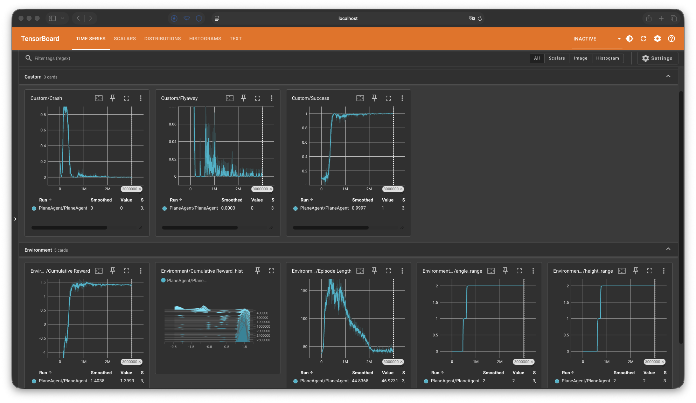
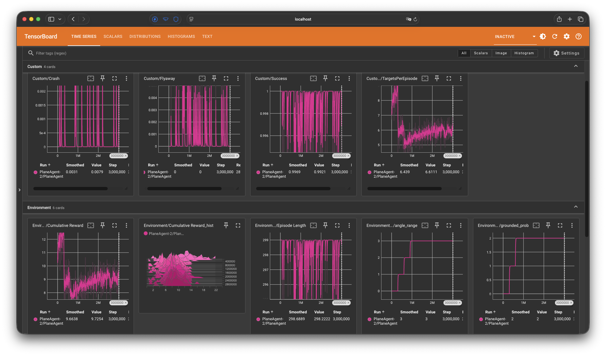

# Unity-RL-Flight-Sim

A Unity ML-Agents flight sim where a PPO agent learns to take off
from a runway and chase waypoints. Trained in stages with curriculum
learning and warm-started checkpoints.


## Highlights
- Takes off from a standstill, climbs out, chains 6+ waypoints per episode
- Learned a real energy-management maneuver (zoom climb / dive) unprompted
- 99.7% success rate, near-zero crash rate at full difficulty

## Getting started
### Requirements
You will need several softwares to get it running:
- Unity 6000.5.2f1
- Python 3.10.12
- ML-Agents 4.0.4
Read ML-Agent's docs for more information: https://docs.unity3d.com/Packages/com.unity.ml-agents@4.0/manual/Installation.html

### Setup
Clone this repo:
```sh
git clone https://github.com/ChinHongTan/Unity-RL-Flight-Sim.git
```
Then, open it in Unity. You will need to reimport the following third-party asset:
- Alstra Infinite/Planes LowPoly (for plane model)
Other assets are currently not used in training.

### Watch the trained agent
In Assets/Scene folder, double click `Plane ML Scene` to open.
The scene should be set up. Simply press Play button on top and
you can enjoy watching AI flying a plane.

### Training from scratch
On Unity's Hierarchy panel, right click `AreaSpawner` and
choose toggle active state to activate it. Right click
the `Training Area` prefab and choose toggle active state to deactivate it.

The config file for ML-Agents is located at /config/planeagent_config.yaml
Trained models will be saved in /results/ folder.
Warm-start command for stage 2 is
```sh
mlagents-learn config/planeagent_config.yaml --run-id=PlaneAgent-2 --initialize-from=PlaneAgent
```

To view tensorboard, use command
```sh
tensorboard --logdir results
```

## How it works
- Observations: the 11-float body-frame vector (bearing, distance,
  velocity, attitude, throttle, altitude) and *why* body-frame
- Actions: 3 continuous (pitch, turn, throttle rate)
- Rewards: terminal ±1, distance-delta shaping, velocity alignment
- Curriculum: angle / height / grounded-probability lessons
- Staged training: stage 1 checkpoint → `--initialize-from` → stage 2

## Results




## Roadmap
Planned to do in my holiday
- [x] Stage 1: waypoint navigation
- [x] Stage 2: takeoff
- [ ] Stage 3: landing
- [ ] Full cycle: takeoff → waypoints → land → rearm
- [ ] Two-team dogfight via self-play