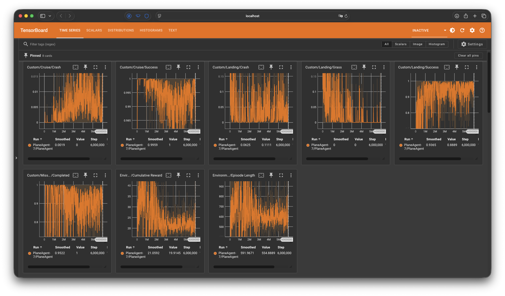

# Unity-RL-Flight-Sim

This repository provides code for a Unity ML-Agents flight sim where
a PPO agent learns to fly fully autonomously from takeoff, cruising and
chasing random targets to landing on the runway. This is made for me to both showcase and explore what game development is, and how reinforcement learning works on a practical level at the same time.

## Overview
The project has four main parts: 
- `Assets/Scripts/PlaneController.cs` for controlling the plane (WASD or arrow keys for navigation, left shift to increase throttle, left control to decrease throttle / brake). 
- `Assets/PlaneAgent.cs` for PPO agent related code
- `Assets/ApproachPlanner.cs` sets up a standard final approach to guide plane from anywhere on the map
- `results` folder stores all the models (.onnx files) from previous failed attempts, and the current working model is `results/PlaneAgent-7/PlaneAgent.onnx`

The other parts are mostly Unity generated stuff or assets that I downloaded from the Unity Asset Store.

The model only excels at flying towards the target, and more complex actions (deciding how or when to land, when to switch between takeoff, cruising, landing) are achieved by code and building a series of guiding target points to help the agent. Just like someone driving with GPS on.

By applying techniques such as reward shaping, early termination if the agent was too far away from the target, and providing body frame observations instead of raw data, the agent converges rapidly with a relatively small network and step budget.

## Background
A few years ago, I watched a video by Code Bullet titled "A.I. Learns to FLY", and in it he provides the full process from making the map to training the agents to fly. However in his video, he stopped after the agents have learnt to takeoff and fly towards targets, and he didn't release his source code either. So after I took my machine learning course in university, I thought I could do another one, expanding on his idea, with landing episodes included, and share what I've learnt.

## Highlights
- An arcade style plane controller that mimics real life aviation, like trading speed with height energy, or stall effects when speed is too low
- A trained PPO agent with success rate of 95.22% that can perform takeoff, cruise and chain 10 targets before landing back at the runway in one go

## Getting started
### Requirements
You will need:
- Unity 6000.5.2f1
- Python 3.10.12
- ML-Agents 4.0.3
You can read ML-Agent's docs for more information or guides on installation: https://docs.unity3d.com/Packages/com.unity.ml-agents@4.0/manual/Installation.html

### Setup
Clone this repo:
```sh
git clone https://github.com/ChinHongTan/Unity-RL-Flight-Sim.git
```
Then, open it in Unity. You will need to reimport the following third-party asset:
- Alstra Infinite/Planes LowPoly (for plane model)
Other assets are currently not used in training.

### Watch the trained agent
In Assets/Scene folder, double click `Plane ML Scene` to open.
The scene should be set up. Simply press Play button on top and
you can enjoy watching AI flying a plane.

### Training from scratch
On Unity's Hierarchy panel, right click `AreaSpawner` and
choose `toggle active state` to activate it. Right click
the `Training Area` prefab and choose `toggle active state` to deactivate it.

The config file for ML-Agents is located at /config/planeagent_config.yaml
Trained models will be saved in /results/ folder.
An example training command:
```sh
mlagents-learn config/planeagent_config.yaml --run-id=<run-id>
```

To warm start a new stage from previous checkpoint, add ```
--initialize-from=<previous-run-id>
```
at the end of command.

More CLI options can be found in this guide:
https://docs.unity3d.com/Packages/com.unity.ml-agents@4.0/manual/Training-ML-Agents.html

To view tensorboard, use command
```sh
tensorboard --logdir results
```

## How it works
This overview will focus on how the `PlaneAgent` script works.

It consists of a neural network of 19 inputs, 2 x 256 hidden units, and 3 outputs that gives the agent ability to fly the plane.

The script runs in a loop. `Initialize` runs once. At the start of every episode, `OnEpisodeBegin` resets state and spawns the plane. Then, every decision step, the agent observes (`CollectObservations`, 19 values) and acts (`OnActionReceived`), which applies the controls, checks termination conditions, handles phase transitions, and pays shaping rewards. Episodes end via `EndEpisode` or at the 10,000-step cap.

`Initialize` function runs first to initialize a session

`OnEpisodeBegin` function resets various flags and counters in each episode

Inputs are defined in the `CollectObservations` function, including bearing of the plane, distance to target, current flight direction, climb, bank, throttle, altitude, offsets help with alignment towards the runway, current phase, and a boolean to tell if the plane has landed.

`OnActionReceived` function apply actions from the agent, check for terminations, switch between phases, updates states and apply shaping rewards

## Results

A mission completion rate of 95.22% after 6 million steps of training


## Roadmap
I'm new in both game development and machine learning, so I will be actively working on 2 directions: Adding better controller / map design for the game development part, and adding new skills for the agent to learn.
- [x] Stage 1: waypoint navigation
- [x] Stage 2: takeoff
- [x] Stage 3: landing
- [x] Full cycle: takeoff → waypoints → land
- [ ] Two-team dogfight via self-play
- [ ] Force based plane controller for more realistic controls